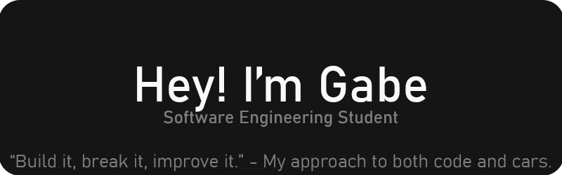

  

---

## 👨‍💻 About Me
Hey, I’m Gabe, a 2nd year Software Engineering student in the UK.  
I like building real stuff that actually works, from desktop apps to mobile and web.  
Strong with **Python, JavaScript, HTML/CSS, PHP, Java, and SQL (MySQL & Oracle)**.  
I learn best by getting hands-on, breaking things, and making them better.  

---

## ⚡ What I’m Working On
**Translator App** - building with a friend, starting as a desktop tool and expanding to **Android/iOS**.  
**Service Log Tracker** - a web app to log and manage vehicle services, maintenance, and performance records.  
Small side projects around clean UI, API integrations, and automation tools.  
Gradually building a portfolio that shows what I can *actually* do, not just what I’ve studied.

---

## 🌱 Currently Learning  
Mobile dev → Android & iOS  
Writing cleaner, more efficient code, not just “it works,” but “it works well.”

---

## 📊 GitHub Stats

  
  

---

## 🎯 Outside Code
**Cars** - my version of engineering in the real world  
**Coffee** - essential fuel for debugging  
**Tinkering** - always figuring out how to make things run better  
Always learning, always improving.

---

Open to collaborations, feedback, and internship opportunities.  
Check out my pinned projects below 👇
